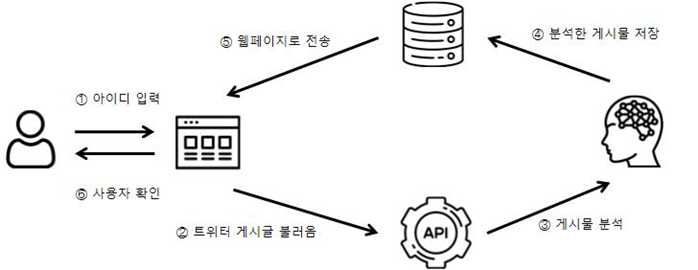

## 선플 악플 구분 서비스

202284057이건해 202204060 이승우.

### 동기및 목적

온라인 상에서의 의사소통의 증가로 악플로 인한 정신적 피해가 사회 문제화되어, 댓글을 분석하여 선플과 악플을 구분함으로써 긍정적인 온라인 댓글 문화를 조성하고자 합니다.
댓글의 긍정/부정 요소를 분석하여 커뮤니티 관리자와 이용자의 이해를 돕고, 선플 문화를 촉진하는 웹/앱 애플리케이션을 만드는 것입니다.

## 시스템 구조

1. 이용자 입력: 이용자는 시스템에 아이디를 입력합니다. 사용자의 정보를 확인합니다.
2. API를 통한 게시글 수집: 입력된 사용자 아이디를 통해 API를 사용하여, 해당 사용자가 작성한 SNS의 게시글을 불러옵니다.
3. 게시글 분석: 불러온 게시글을 AI 감정 분석을 사용해 선플인지 악플인지 분석합니다.
4. 이용자 확인: 이용자는 웹페이지에서 자신의 분석된 게시글 결과를 확인할 수 있습니다.

## 개발 방법론

애자일 방법론을 기반으로 진행됩니다. 

## 주요 기능

|   주요기능    |      내용                            |
| ---------- | ----------------------------------------------- |
| 1. 댓글 분류모델(NLP 기반)   |실시간긍정/부정/중립분석, 로지스틱회귀, BERT,                 |
|2. 딥러닝 기반 감정분석    | BERT, CNN, RNN 모델 활용 모델분석최적화    |
|3. 댓글 패턴 분석  | 장기적댓글분석,주간/월간                    |
|4. 커뮤니티 및 피드백시스템 | 분석결과 제공, 긍정적인 커뮤니티참여지원                 |

## 일정

| 주차       |  표 작업                                   |
| ---------- | ----------------------------------------------- |
| 1~2주차    |프로젝트 기획 및 자료 조사                       |
| 3~4주차    | 계획서 발표                         |
| 5~6주차    | 데이터 수집 및 전처리                       |
| 7~8주차    | 감정 분석 모델 개발                     |
| 9~10주차   | 모바일 애플리케이션 개발                             |
| 11~12주차  |추가 데이터 및 성능 향상           |
| 13~14주차  | 최종 배포                      |
| 15주차     | 최종 발표                            |

## 기대효과

- 악플을 감지하고 차단하여 사용자들의 정신적피해를줄입니다.
- 선플을 장려하고 악플을 억제하여 건전한 소통 문화를 형성합니다.
- 악플 감소와 선플 증가로 커뮤니티의 신뢰도와 사용자 만족도가 향상됩니다.
